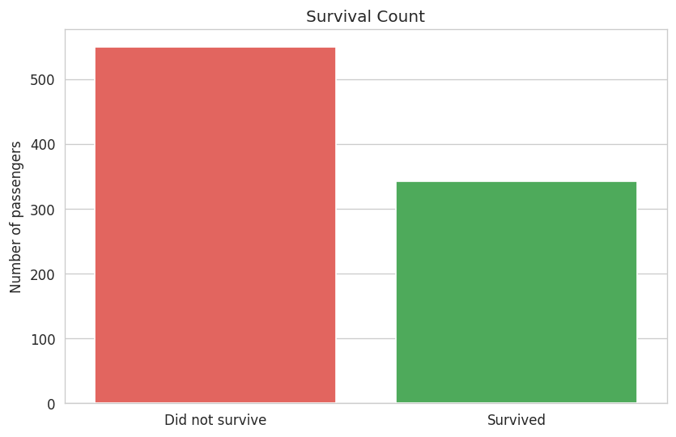
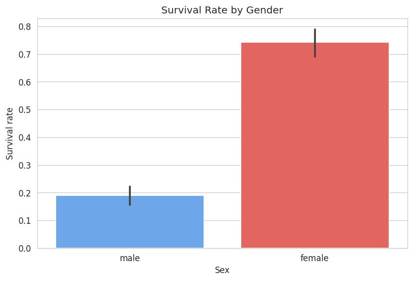
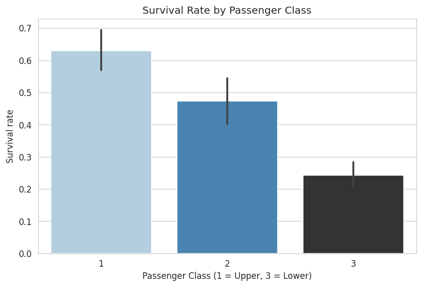
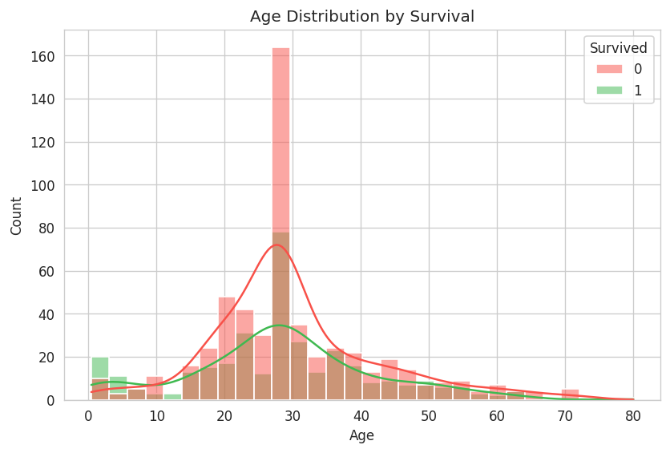
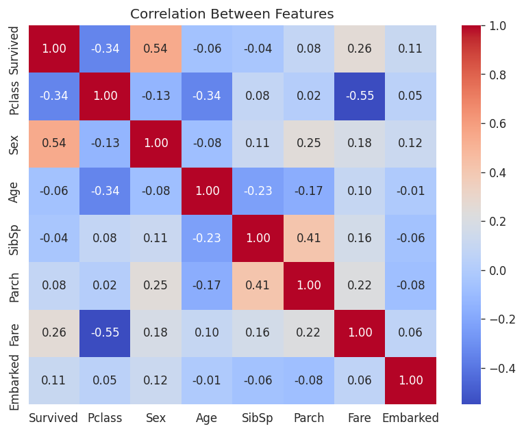
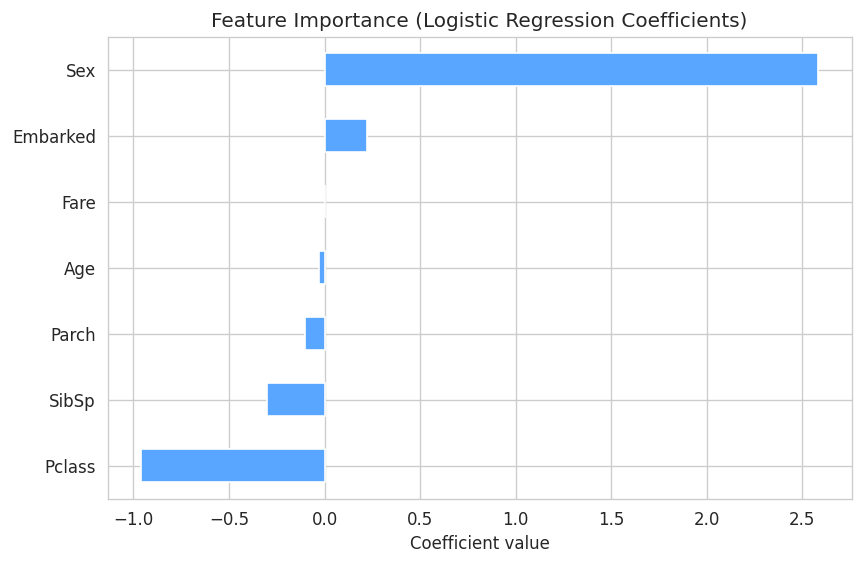

# Titanic Survival Analysis

Exploratory data analysis and a machine learning model that predicts passenger survival on the Titanic, using the real 1912 passenger dataset (891 passengers).

## Overview
This project explores which factors — gender, passenger class, age, and fare — most influenced whether a Titanic passenger survived, then trains a Logistic Regression model to predict survival on unseen data.

## Key Findings
- Overall survival rate: **38.4%**
- **Gender** was the strongest survival factor — women survived at a far higher rate than men
- **Passenger class** mattered significantly — 1st class passengers survived far more often than 3rd class
- **Age** played a role — young children had better survival odds than adults
- A Logistic Regression model trained on 7 features achieved **79.9% accuracy** on the test set

## Visualizations
| | |
|---|---|
| |  |  | |
| !|  |  |
| ! ||  |  |

## Tech Stack
- **Python** — pandas, numpy for data handling
- **Matplotlib & Seaborn** — data visualization
- **Scikit-learn** — Logistic Regression model, train/test split, evaluation metrics

## Project Structure
```
titanic-analysis/
├── data/
│   └── titanic.csv          # raw dataset
├── images/                  # exported charts
├── titanic_analysis.ipynb   # full analysis notebook
├── requirements.txt
└── README.md
```

## How to run
1. Clone this repository
   ```bash
   git clone https://github.com/radhikasingh6627-bit/titanic-survival-analysis.git
   cd titanic-survival-analysis
   ```
2. Install dependencies
   ```bash
   pip install -r requirements.txt
   ```
3. Open the notebook
   ```bash
   jupyter notebook titanic_analysis.ipynb
   ```

## What I learned
- Performing structured EDA (missing value handling, feature cleaning) on a real-world dataset
- Communicating insights clearly through visualizations
- Building and evaluating a classification model with scikit-learn
- Interpreting model coefficients to understand feature importance

## Future improvements
- Compare against Random Forest / XGBoost models
- Feature engineering (e.g., family size, title extraction from names)
- Hyperparameter tuning with cross-validation
